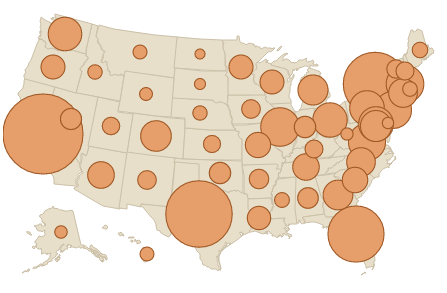

<style type = "text/css">
h1 {
  background-color: #CCCCCC;
  padding:5px;
  border:1px solid #AAAAAA;
}
h2 {
  background-color: #DDDDDD;
  padding:5px;
  border:1px solid #AAAAAA;
}
h3 {
  background-color: #EEEEEE;
  padding:5px;
  border:1px solid #AAAAAA;
}
</style>

# 1. Introduction: 

__Research question:__

What can we learn about the American presidential election process by studying the candidates:

* Number of Contributions
* Total Contributions
* Average Contribution
* Where the candidate falls on the political spectrum
* Who received the largest donations?
* How big are the donation? (1st-3rd Quartiles)
* Are there donation patterns across the left-to-right political spectrum?
* Are there relationsips between donations and other features of the candidate?
* Does testing a subset of the data, due to hardware limits, produce a statistically accurate snapshot of the donations?


__Why we should care:__

* We should care about the number of, sizes, and totals of contributions to help us see if our government is truly serving its people, or rather serving special interests. 

# 2. Data: 

__Data collection:__

* Election Data was downloaded and loaded from: http://www.fec.gov/disclosurep/PDownload.do
* Political Spectrum information about the candidates was taken from: http://www.huffingtonpost.com/findthebest-/every-2016-candidate-from_b_7562176.html

__Cases:__

* Each case in this study was an individual campaign contribution.

__Variables:__ 

* The two (groups of) variables that will be studied are 1) Contributions, and 2) Candidate Political Spectrum Score:
* Note that after analysis, the most relevant of the contribution statistics will be used (of contribution total, contribution mean, and contribution_count)

__Type of study:__ 

This is an observational study, and not an experiment one? (Explain how you've arrived at your conclusion using information on the sampling and/or experimental design.)

__Scope of inference:__ 

* Generalizability: The population of interest is the American voting public of 2016. The findings from this analysis need not be generalized as they are the full representation of that data. They may be generalizable to some extent from election year to election year, but as national situations and priorities change, the dynamics of the election model may change too. There is bias in this data in assuming that all contribution sources are the same.  There are many attributes that make up an individual, and none of these have been taken into account in this project.

* Causality: I believe the data can be used to establish causal links between the variables of interest. The average donation sizes, in my opinion, seem to be the greatest indicator of the wishes of the Americans with less money, while the largest donations will show the wishes of the Americans with the most money.

# 3. Exploratory data analysis: 

## 3A) The Candidates, Donations, and the Candidates' Spectrum:

```{r warning=FALSE, message=FALSE, echo=FALSE}
library(knitr)
library(ggplot2)
library(sqldf)

SHOW_UNKNOWNS <- FALSE
#SAMPLE_SIZE <- 'ALL'
#SAMPLE_SIZE <- 5000
SAMPLE_SIZE <- '1170160'

# Its the WRITING that takes most the time!!!!
DO_WRITE_SAMPLES <- FALSE 

# this is a general plot method for use during part 3 exploration
util_plot_stat <- function(df, the_title, the_y_title, the_aes, the_year){
  plt <- ggplot(df, the_aes)
  plt <- plt + stat_summary(fun.y=identity, geom="bar")
  plt <- plt + scale_fill_manual(values=c("red", "blue", "green"), guide = FALSE)
  plt <- plt + theme(axis.text.x = element_text(angle = 90, hjust = 1))
  plt <- plt + labs(title=paste(the_title, the_year) ,x="Candidate", y=the_y_title) 
  show(plt)
}

```

The base donations data is loaded. The finished product relies on reports generated from 2016_donations_ALL.csv (about 225 MB), while during development, smaller samples are used, such as 2016_donations_5000.csv.  Below is the code that generated those samples based on the large dataset, as well as the loading of the csv into a data frame:

```{r warning=FALSE, message=FALSE, echo=FALSE}
write_sample_set <- function(sample_size, year){
  print(Sys.time())
  all_csv_path <- paste0(year,"_donations_ALL.csv")
  df <- read.csv(all_csv_path, header=TRUE)

  if(sample_size > 0){
    # this is where the SUBSET is created:
    df <- df[sample(nrow(df), sample_size), ]
  }
  print(kable(head(df)))
  file_name <- paste0(year,"_donations_",nrow(df),".csv")
  write.csv(df, file = file_name)
  print(Sys.time())
}

if(DO_WRITE_SAMPLES){
  #write_sample_set(SAMPLE_SIZE, 2012)
  write_sample_set(SAMPLE_SIZE, 2016)
}

```

Next, since the presidential candidates were a small set of data, data was manually copied from http://www.huffingtonpost.com/findthebest-/every-2016-candidate-from_b_7562176.html into a data frame. 

```{r warning=FALSE, message=FALSE, echo=FALSE}
util_get_data_frame <- function(the_year){
  file_name <- paste0(the_year,"_donations_",SAMPLE_SIZE,".csv")
  df <- read.csv(file_name, header=TRUE, row.names=NULL)
  df$contb_receipt_amt <- as.numeric(as.character(df$contb_receipt_amt))
  df <- df[with(df, order(-contb_receipt_amt, contb_receipt_amt)), ]
  df$millions <- df$contb_receipt_amt / 1000000

  
  df[,"spectrum_score"] <- 0.0

  df[df$cand_nm == "Cruz, Rafael Edward 'Ted'", "spectrum_score"] <- 8
  df[df$cand_nm == "Rubio, Marco", "spectrum_score"] <- 6.8
  df[df$cand_nm == "Bush, Jeb", "spectrum_score"] <- 4.8
  df[df$cand_nm == "Clinton, Hillary Rodham", "spectrum_score"] <- -6.8
  df[df$cand_nm == "Christie, Christopher J.", "spectrum_score"] <- 2.5
  df[df$cand_nm == "Fiorina, Carly", "spectrum_score"] <- 4.8
  df[df$cand_nm == "Carson, Benjamin S.", "spectrum_score"] <- 5.8
  df[df$cand_nm == "Kasich, John R.", "spectrum_score"] <- 5
  df[df$cand_nm == "Sanders, Bernard", "spectrum_score"] <- -8.5
  df[df$cand_nm == "Trump, Donald J.", "spectrum_score"] <- 4
  df[df$cand_nm == "Paul, Rand", "spectrum_score"] <- 2.2

  if(SHOW_UNKNOWNS){
    df[df$cand_nm == "Walker, Scott", "spectrum_score"] <- 6.8
    df[df$cand_nm == "Jindal, Bobby", "spectrum_score"] <- 7.2
    df[df$cand_nm == "Graham, Lindsey O.", "spectrum_score"] <- 6
    df[df$cand_nm == "O'Malley, Martin Joseph", "spectrum_score"] <- -4.5
    df[df$cand_nm == "Kasich, John R.", "spectrum_score"] <- 5
    df[df$cand_nm == "Sanders, Bernard", "spectrum_score"] <- -8.5
    df[df$cand_nm == "Trump, Donald J.", "spectrum_score"] <- 4
    df[df$cand_nm == "Paul, Rand", "spectrum_score"] <- 2.2
  }
  
  cols_to_trash <- c(1,2,3,5,9,13,14,15,16,17,18,19,20)
  # Cutting it down to just the candidates I recognize!
  df <- df[df$spectrum_score != 0.0,-cols_to_trash]
  df$the_color <- ifelse(df$spectrum_score < 0, '#FF0000', '#0000FF')

  df$party <- ifelse(df$spectrum_score < 0, 'Democrat', 'Republican')

return (df)
}
```

Below are the relevant features from this set of data:

```{r warning=FALSE, message=FALSE, echo=FALSE}
df <- util_get_data_frame(2016)
kable(head(df[,c("cand_nm","contbr_city","contbr_st","contb_receipt_amt","spectrum_score","party")]))

summary_df <- sqldf("select cand_nm, count(*) as contribution_count, sum(contb_receipt_amt) as contribution_total, (sum(contb_receipt_amt)/count(*)) as contribution_mean, max(spectrum_score) as spectrum_score from df group by cand_nm order by spectrum_score desc ", stringsAsFactors = FALSE)


summary_df$party <- ifelse(summary_df$spectrum_score < 0, 'Democrat', 'Republican')

summary_df$millions <- summary_df$contribution_total / 1000000

```

## 3B) Analyze total contributions per candidate:

```{r warning=FALSE, message=FALSE, echo=FALSE}

contribution_sums <- aggregate(df$millions, by=list(cand=df$cand_nm, clr=df$the_color), FUN=sum)

colnames(contribution_sums) <- c('candidate', 'the_color', 'millions')
contribution_sums <- contribution_sums[order(-contribution_sums$millions),] 
kable(contribution_sums[,c(1,3)])
the_aes <- aes(fill=the_color, x=reorder(candidate, -millions), y=millions)
util_plot_stat(contribution_sums, "Total Contributions", "Millions", the_aes, 2016)      

```

## 3C) Analyze contribution MEAN by spectrum score:

```{r warning=FALSE, message=FALSE, echo=FALSE}
contribution_means <- aggregate(df$contb_receipt_amt, by=list(Category=df$spectrum_score, clr=df$the_color), FUN=mean)
colnames(contribution_means) <- c('spectrum_score', 'the_color', 'dollars')
contribution_means <- contribution_means[order(-contribution_means$dollars),] 
kable(contribution_means[,c(1,3)])
the_aes <- aes(fill=the_color, x=spectrum_score, y=dollars)
plt <- ggplot(contribution_means, the_aes)
plt <- plt + stat_summary(fun.y=identity, geom="bar")
plt <- plt + labs(title=paste("Mean Contributions and Spectrum Score", 2016) ,x="Spectrum Score", y="Dollars") 
plt <- plt + scale_fill_manual(values=c("red", "blue", "green"), guide = FALSE)

show(plt)

```

## 3D) Contribution Totals by party:

```{r warning=FALSE, message=FALSE, echo=FALSE}

party_sums <- aggregate(df$millions, by=list(cand=df$party, clr=df$the_color), FUN=sum)

colnames(party_sums) <- c('party', 'the_color', 'millions')
kable(head(party_sums[,c(1,3)]))
the_aes <- aes(fill=the_color, x=reorder(party, -millions), y=millions)
util_plot_stat(party_sums, "Total Contributions", "Millions", the_aes, 2016)      

```

## 3E) Average Joe (mean contributions by candidate):

Let's take a look at the MEAN contributions per candidate:

```{r warning=FALSE, message=FALSE, echo=FALSE}

contribution_means <- aggregate(df$contb_receipt_amt, by=list(Category=df$cand_nm, clr=df$the_color), FUN=mean)
colnames(contribution_means) <- c('candidate', 'the_color', 'dollars')
contribution_means <- contribution_means[order(-contribution_means$dollars),] 
kable(contribution_means[,c(1,3)])
the_aes <- aes(fill=the_color, x=reorder(candidate, -dollars), y=dollars)
util_plot_stat(contribution_means, "Mean Contributions", "Dollars", the_aes, 2016)      

```

## 3F) Contribution Counts:

How many UNIQUE contributions per candidate:

```{r warning=FALSE, message=FALSE, echo=FALSE}
contribution_counts <- aggregate(df$contb_receipt_amt, by=list(Category=df$cand_nm, clr=df$the_color), FUN=length)

colnames(contribution_counts) <- c('candidate','the_color', 'contr_count')
contribution_counts <- contribution_counts[order(-contribution_counts$contr_count),] 
kable(contribution_counts[,c(1,3)])
the_aes <- aes(fill=the_color, x=reorder(candidate, -contr_count), y=contr_count)
util_plot_stat(contribution_counts, "Number of Contributions", "Count", the_aes, 2016)      

```

## 3G) Another vantage point of the data from above in a single plot:

```{r warning=FALSE, message=FALSE, echo=FALSE}
ggplot(summary_df, aes(cand_nm, millions)) + labs(title="2016 Contribution Totals" , x="Candidate", y="Contribution Total - Millions") + theme(axis.text.x = element_text(angle = 90, hjust = 1)) + geom_point(aes(shape=party, colour=spectrum_score, size=contribution_total)) + scale_colour_gradient(limits=c(-10, 10), low="navy", high="red")


ggplot(summary_df, aes(cand_nm, spectrum_score)) + labs(title="2016 Contribution Sums" , x="Candidate", y="Spectrum Score") + theme(axis.text.x = element_text(angle = 90, hjust = 1)) + geom_point(aes(shape=party, colour=spectrum_score, size=contribution_total)) + scale_colour_gradient(limits=c(-10, 10), low="navy", high="red")
```


## 3H) Check the T-Distributions:

```{r warning=FALSE, message=FALSE, echo=FALSE}
fit <- lm(spectrum_score~contribution_count+contribution_total+contribution_mean+party, data=summary_df)

summary(fit)
```

The __partyRepublican__ asterisk does not tell us much, as we know that the spectrum score is correlated to the political party.

However, the * in contribution_total shows as unlikely to be by chance.


## 3I) Population % vs. Donation %:

http://www.census.gov/popest/data/national/totals/2015/files/NST-EST2015-alldata.csv

```{r message=FALSE, warning=FALSE, echo=FALSE}

state_pops_df <- read.csv("NST-EST2015-alldata.csv", header=TRUE)
state_pops_df <- state_pops_df[state_pops_df["STATE"] > 0, c("STATE","NAME","POPESTIMATE2015")]
colnames(state_pops_df) <- c("STATE_NUM","STATE","POPULATION")
state_pops_df$POPULATION <- as.numeric(as.character(state_pops_df$POPULATION))

contr_by_state_df <- df[,c("contbr_st","party","contb_receipt_amt")]
contr_by_state_df$contb_receipt_amt <- as.numeric(as.character(contr_by_state_df$contb_receipt_amt))

# need this to do the join
state_abbs <- data.frame(state.abb, state.name)
colnames(state_abbs) <- c("state_abb", "state_name")

state_donations_df <- sqldf("select state_abb as state, population, party, sum(contb_receipt_amt) as contrb_total from state_pops_df, state_abbs, contr_by_state_df where state_name = STATE and state_abb = contbr_st group by state, population, party", stringsAsFactors = FALSE)

state_donations_df$us_pop <- sum(state_donations_df$POPULATION)
state_donations_df$us_contr_total <- sum(state_donations_df$contrb_total)

state_donations_df$pct_pop <- state_donations_df$POPULATION / state_donations_df$us_pop
state_donations_df$pct_contr <- state_donations_df$contrb_total / state_donations_df$us_contr_total

state_donations_df$contr_score <- state_donations_df$pct_contr / state_donations_df$pct_pop
state_donations_df$us_contr_score <- state_donations_df$us_contr_total / state_donations_df$us_pop

kable(head(state_donations_df[,-which(names(state_donations_df) %in% c("us_pop", "us_contr_total", "us_contr_score"))], n=10))

ggplot(state_donations_df, aes(x=state, y=contr_score, group=party)) + geom_line(aes(colour=party)) + theme(axis.text.x = element_text(angle = 90, hjust = 1))

contr_by_state_model <- lm(contr_score~us_pop+party, data=state_donations_df)
summary(contr_by_state_model)

##########################

ggplot(state_donations_df, aes(x=pct_pop, y=pct_contr)) + geom_point() + theme(axis.text.x = element_text(angle = 90, hjust = 1))

mdl2 <- lm(pct_contr~pct_pop, data=state_donations_df)
summary(mdl2)

plot(pct_contr ~ pct_pop, data = state_donations_df)
abline(mdl2)
abline(0,1, col="blue")

```

Note that in the above chart, the mean abline is blue, while the actual is black.  It seems that the states that represent larger percentages of the overall population actually donate a higher __Percentage__ than their state counterparts.


# 4. Inference: 

It seems that the difference in the numbers of candidates running in each party makes it difficult to do any nominee-to-nominee comparisons.  With that said, let's look to some of the other possible models and see if they have any more strong correlations:

```{r warning=FALSE, message=FALSE, echo=FALSE}
fit2 <- lm(contribution_count~spectrum_score+party, data=summary_df)
summary(fit2)

fit3 <- lm(contribution_total~spectrum_score+party, data=summary_df)
summary(fit3)

fit4 <- lm(contribution_mean~spectrum_score+party, data=summary_df)
summary(fit4)
```



# 5. Conclusion

__My Findings:__

* There were other interesting data sets available, such as WHO the donations came from, when in the campaign lifecycle they came, etc.
* I normally pictured these data sets with very "distinct" columns, ie - with truly distinct meanings.  This data set showed me that you can create fields with different meanings, all based on the same data (ie - dollars per contribution, total contributions, total number of contributions - all the same data, but different underlying meanings.)
* Based on this project, some questions that I would be curious about in the future are:
  + Which types of groups are donating the large amounts?
  + Which companies are truly just 'bribing' their candidates by contributing to all the candidates.
  + System memory limits really were an issue.  I knew that this was a problem in industry, but was not really expecting to get so many out-of-memory errors running Rmd scripts.

